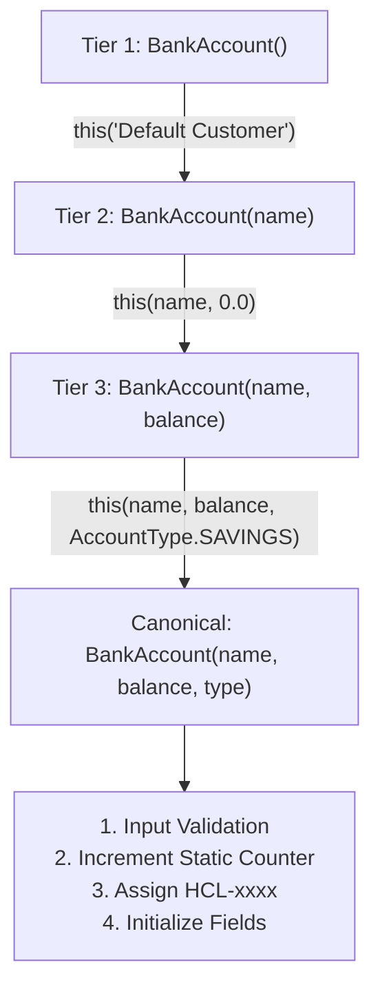
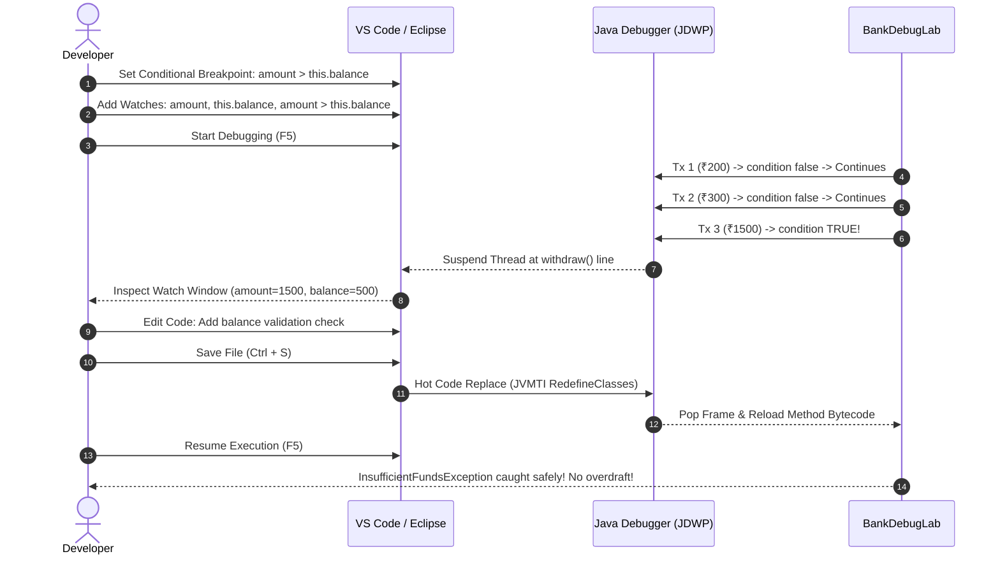

# 🏦 Day 4 Notes: BankAccount OOP Architecture & Java Debugging Lab

A comprehensive guide and reference implementation covering **Object-Oriented Programming (OOP) fundamentals** (encapsulation, static counters, 3-tier constructor chaining, domain validation, strict `equals()` / `hashCode()` contracts) and an interactive **Debugging Lab** demonstrating **Conditional Breakpoints**, **Watch Expressions**, and **Hot Code Replace (HCR)**.

---

## ⚡ Quick Cheat Sheet

| Concept | Syntax / Implementation | Purpose & Banking Context |
| :--- | :--- | :--- |
| **Encapsulation** | `private double balance;` | Protects state from arbitrary external mutation; accessed via validated methods |
| **Static Counter** | `private static int accountCounter = 1000;` | Class-level state shared across instances to auto-generate unique account numbers (`HCL-1001`) |
| **Constructor Chaining** | `this("Default Customer");` / `this(name, 0.0);` | Eliminates duplicated initialization logic by delegating to a master canonical constructor |
| **Validation** | `if (amount <= 0) throw new InvalidAmountException(...)` | Enforces domain rules prior to updating balances |
| **`equals()` & `hashCode()`** | Based on unique `accountNumber` | Adheres to Java contract; guarantees correct hashing behavior in `HashSet` and `HashMap` |
| **Conditional Breakpoint** | Expression: `amount > this.balance` | Suspends execution *only* when the condition evaluates to `true`, skipping valid transactions |
| **Watch Expressions** | `amount`, `this.balance`, `amount > this.balance` | Evaluates live variable values and boolean expressions in the IDE debugger panel |
| **Hot Code Replace (HCR)** | Save (`Ctrl+S`) while paused in debug mode | JVM HotSwap replaces class bytecode in memory without restarting the running application |

---

## 🏗️ Project Architecture & Package Structure

```text
Day_4/
├── pom.xml                                               # Maven build configuration (Java 17, JUnit 5)
├── README.md                                             # Comprehensive documentation and lab guide
└── src/
    ├── main/
    │   └── java/
    │       └── com/
    │           └── hcl/
    │               └── bank/
    │                   ├── model/
    │                   │   ├── AccountType.java          # Enum: SAVINGS, CURRENT, SALARY
    │                   │   ├── BankAccount.java          # Core model (encapsulation, static counter, chaining, bug)
    │                   │   ├── InsufficientFundsException.java # Overdraft safeguard exception
    │                   │   └── InvalidAmountException.java     # Zero/negative amount exception
    │                   ├── service/
    │                   │   └── BankService.java          # Domain service (accounts store, transfer, liquidity)
    │                   └── app/
    │                       ├── BankApplication.java     # Main showcase application
    │                       └── BankDebugLab.java        # Interactive debugging harness for lab exercise
    └── test/
        └── java/
            └── com/
                └── hcl/
                    └── bank/
                        └── BankAccountTest.java          # JUnit 5 test suite verifying contracts & logic
```

---

## 🧩 Core Concepts Breakdown

### 1. Encapsulation with Private Fields
All state variables (`accountNumber`, `accountHolderName`, `balance`, `accountType`, `createdAt`) are declared `private`.
- The `accountNumber` and `createdAt` fields are marked `final` to ensure immutability once created.
- Direct external mutation of `balance` is forbidden; balance can only transition via validated domain methods (`deposit()` and `withdraw()`).

### 2. Static Counter vs Instance State
- **Instance Variables** (`balance`, `accountHolderName`) are allocated on the **Heap** for each separate object instance.
- **Static Variables** (`accountCounter`, `totalAccountsCreated`) belong to the class definition in **Metaspace / Class Area**.
- Each time any constructor is invoked, `accountCounter++` generates a guaranteed sequential account identifier:

$$\text{Account Number} = \text{"HCL-"} + (++\text{accountCounter}) \implies \text{HCL-1001, HCL-1002, \dots}$$

```java
// Class-level shared sequence
private static int accountCounter = 1000;
private static int totalAccountsCreated = 0;

// Inside canonical constructor:
accountCounter++;
totalAccountsCreated++;
this.accountNumber = String.format("HCL-%04d", accountCounter);
```

---

### 3. 3-Tier Constructor Chaining (`this(...)`)
Constructor chaining follows the **Don't Repeat Yourself (DRY)** principle. Secondary constructors pass default arguments downward until reaching the canonical master constructor:



```java
// Tier 1: Default
public BankAccount() {
    this("Default Customer");
}

// Tier 2: 1-Parameter
public BankAccount(String accountHolderName) {
    this(accountHolderName, 0.0);
}

// Tier 3: 2-Parameter
public BankAccount(String accountHolderName, double initialBalance) {
    this(accountHolderName, initialBalance, AccountType.SAVINGS);
}

// Canonical Master Constructor
public BankAccount(String accountHolderName, double initialBalance, AccountType accountType) {
    if (accountHolderName == null || accountHolderName.trim().isEmpty()) {
        throw new IllegalArgumentException("Account holder name cannot be null or blank.");
    }
    if (initialBalance < 0.0) {
        throw new InvalidAmountException("Initial balance cannot be negative: " + initialBalance);
    }
    accountCounter++;
    totalAccountsCreated++;
    this.accountNumber = String.format("HCL-%04d", accountCounter);
    this.accountHolderName = accountHolderName.trim();
    this.balance = initialBalance;
    this.accountType = (accountType != null) ? accountType : AccountType.SAVINGS;
    this.createdAt = LocalDateTime.now();
}
```

---

### 4. `equals()` and `hashCode()` Contract
When storing domain entities in Java collections like `HashSet` or `HashMap`, `equals()` and `hashCode()` must be strictly implemented based on a stable business key (`accountNumber`):

1. **Reflexive**: `x.equals(x)` returns `true`.
2. **Symmetric**: `x.equals(y) == y.equals(x)`.
3. **Transitive**: `x.equals(y)` and `y.equals(z)` implies `x.equals(z)`.
4. **Consistent**: Multiple invocations consistently return the same boolean.
5. **Non-nullity**: `x.equals(null)` returns `false`.
6. **HashCode Rule**: If `a.equals(b)` is `true`, then `a.hashCode() == b.hashCode()` **must** be true.

```java
@Override
public boolean equals(Object o) {
    if (this == o) return true;
    if (o == null || getClass() != o.getClass()) return false;
    BankAccount that = (BankAccount) o;
    return Objects.equals(this.accountNumber, that.accountNumber);
}

@Override
public int hashCode() {
    return Objects.hash(accountNumber);
}
```

---

## 🐛 Interactive Debugging Lab Walkthrough

### Problem Statement
In `BankAccount.java`, the `withdraw(double amount)` method contains a planted bug when `PLANTED_BUG_ACTIVE` is enabled:
```java
// PLANTED BUG in withdraw():
if (PLANTED_BUG_ACTIVE) {
    this.balance -= amount; // Allows balance to become negative!
    return;
}
```

When a batch of transactions is executed:
- **Tx 1**: Withdraw ₹200 from ₹1000 $\to$ ₹800 (Valid)
- **Tx 2**: Withdraw ₹300 from ₹800 $\to$ ₹500 (Valid)
- **Tx 3**: Withdraw ₹1500 from ₹500 $\to$ **₹-1000 (Illegal Overdraft Bug!)**
- **Tx 4**: Withdraw ₹100 $\to$ ₹-1100

We do **not** want to pause on Tx 1 or Tx 2. We only want the debugger to stop when the balance is insufficient (`amount > this.balance`).

---

### Step-by-Step Debugging in VS Code / IDE



#### Step 1: Place a Conditional Breakpoint
1. Open [`BankAccount.java`](file:///e:/HCL_Training/Daily_Task/Day_4/src/main/java/com/hcl/bank/model/BankAccount.java).
2. Locate the line inside `withdraw(double amount)`:
   ```java
   this.balance -= amount;
   ```
3. Right-click the line number in the left margin/gutter and select **Add Conditional Breakpoint...** (or **Edit Breakpoint**).
4. Enter the expression:
   ```java
   amount > this.balance
   ```
   *(Or `this.balance - amount < 0`)*

#### Step 2: Configure Watch Expressions
In the IDE's **Run & Debug** side panel (`Ctrl+Shift+D`), look for the **WATCH** panel. Click `+` to add:
- `amount`
- `this.balance`
- `amount > this.balance`
- `this.balance - amount`

#### Step 3: Launch Debug Session
Run the configuration **"Debug Day 4 - Interactive Debugging Lab"** from `.vscode/launch.json` (or click "Debug" above `main` in [`BankDebugLab.java`](file:///e:/HCL_Training/Daily_Task/Day_4/src/main/java/com/hcl/bank/app/BankDebugLab.java)).

> Notice:
> - Tx 1 (₹200) executes smoothly without stopping.
> - Tx 2 (₹300) executes smoothly without stopping.
> - The debugger **halts execution on Tx 3** (`amount = 1500.0`, `this.balance = 500.0`).

#### Step 4: Inspect the Watch Panel
Look at the **WATCH** panel:
- `amount`: `1500.0`
- `this.balance`: `500.0`
- `amount > this.balance`: `true`
- `this.balance - amount`: `-1000.0`

#### Step 5: Perform Hot Code Replace (HCR)
While execution is paused:
1. In [`BankAccount.java`](file:///e:/HCL_Training/Daily_Task/Day_4/src/main/java/com/hcl/bank/model/BankAccount.java), toggle the bug flag or fix the check directly:
   ```java
   // Toggle flag:
   public static boolean PLANTED_BUG_ACTIVE = false;
   ```
   *or replace the faulty branch with:*
   ```java
   if (amount > this.balance) {
       throw new InsufficientFundsException("Insufficient funds! Available: " + this.balance);
   }
   this.balance -= amount;
   ```
2. Press **`Ctrl + S`** (Save).
3. The IDE debugger outputs:
   `Hot Code Replace succeeded / reloaded class BankAccount`.
4. Press **`F5` (Continue)** or Step Over (**`F10`**).
5. Watch the terminal: The overdraft attempt is intercepted, `InsufficientFundsException` is caught, and the account balance remains protected at ₹500!

---

## 🚀 Build & Execution Guide

### 1. Compile & Run Tests via Maven
```powershell
cd e:\HCL_Training\Daily_Task\Day_4
mvn clean test
```

### 2. Run Main Application
```powershell
java -cp target/classes com.hcl.bank.app.BankApplication
```
*Or via Maven:*
```powershell
mvn compile exec:java
```

### 3. Run Interactive Debug Lab
```powershell
java -cp target/classes com.hcl.bank.app.BankDebugLab
```

---

## 📋 Summary Checklist

- [x] **Private fields**: `accountNumber`, `accountHolderName`, `balance`, `accountType`, `createdAt`
- [x] **Static counter**: `accountCounter` and `totalAccountsCreated` for unique ID generation
- [x] **3 Chained constructors**: Default $\to$ 1-arg $\to$ 2-arg $\to$ Canonical 3-arg constructor
- [x] **Validated operations**: Positive amount enforcement on `deposit()` and `withdraw()`
- [x] **`equals()` & `hashCode()`**: Identity based on unique `accountNumber` with full contract compliance
- [x] **Layered package structure**: `model`, `service`, `app`
- [x] **Debugging lab**: Planted bug, Conditional Breakpoint condition, Watch panel variables, and Hot Code Replace instructions
- [x] **Unit tests**: 6 passing JUnit 5 tests covering all edge cases
